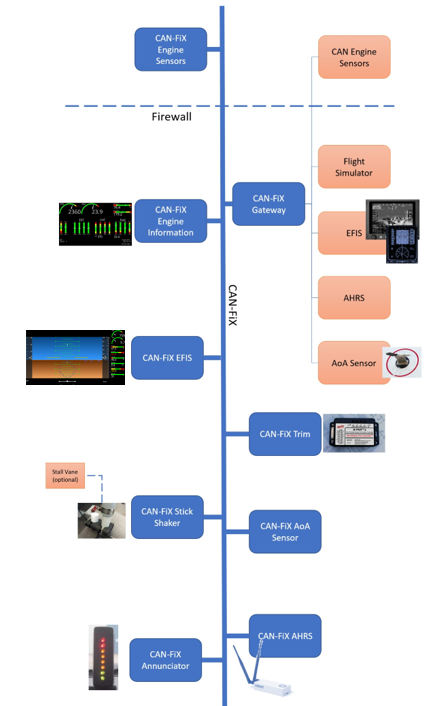
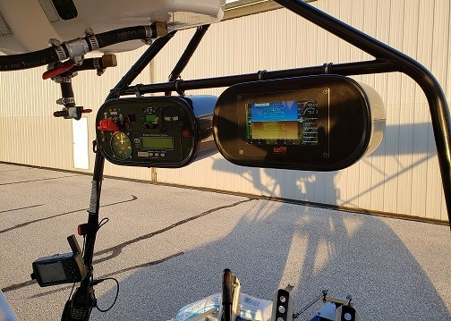
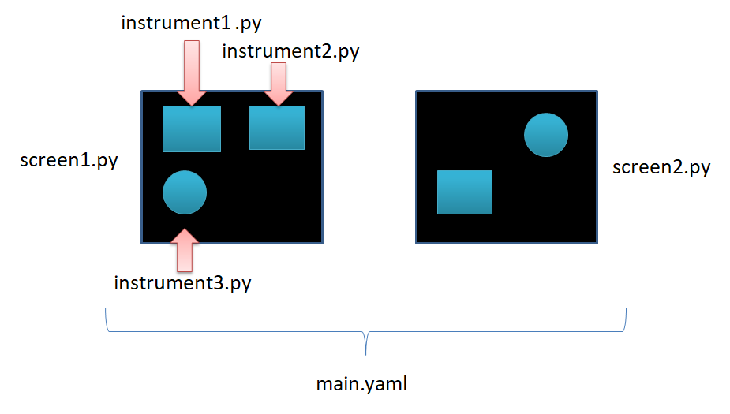
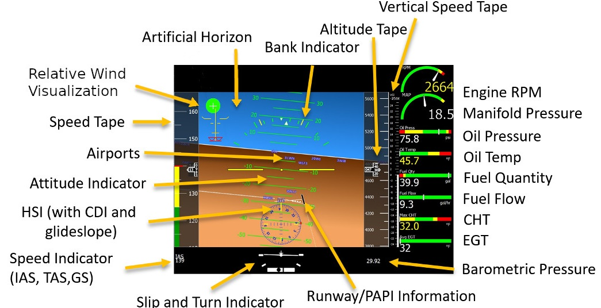
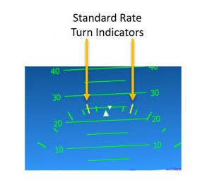
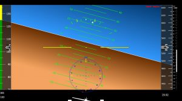
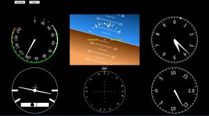
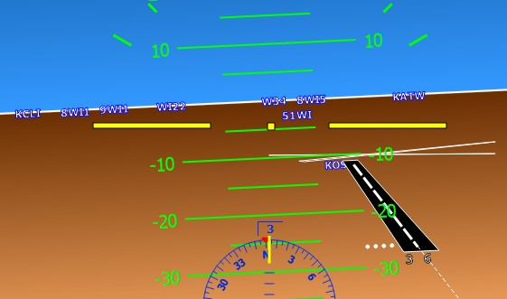

******
pyEFIS
******

Document Purpose
================

The purpose of this document is to provide an overview of the MakerPlane pyEFIS
application as well as its installation, customization and normal operation.

Related Documentation
=====================

The following shows the related documents within the MakerPlane CAN-FiX Avionics
environment.

    1. CAN-Fix protocol specification;
    2. MakerPlane CAN-FiX Avionics – FiX Gateway, PyAvTools, CANArduino;
    3. MakerPlane pyEFIS Application; and
    4. MakerPlane pyAvMap Application.

Introduction
============

pyEFIS is an Electronic Flight Information System (EFIS) written in Python and
PyQT. It was originally created for use in the MakerPlane Open Source Aircraft
Project.

It does not have any method of reading flight information directly from the
hardware but instead uses FIX Gateway [#f1]_ as its source of information.  FIX
Gateway is a plugin based program that allows different types of flight
information systems to communicate with one another.  pyEfis contains a client
to FIX Gateway and so has access to all the flight data that FIX Gateway is
configured for.

System of Systems
=================

A “system of systems” is defined as a collection of task-oriented or
dedicated systems that pool their resources and capabilities together to create
a new, more complex system which offers more functionality and performance than
simply the sum of the constituent systems.

The MakerPlane solution as a system of systems that can not only be used as a
complete avionics solution in an experimental aircraft, it can also be used as
an innovation platform and test bed for avionics and aircraft systems.  It is
already a well-populated ecosystem with flight proven implementations including
pyEFIS, pyAvMap moving map, Engine Information System (EIS), trim controllers,
annunciators, audio solutions and so on.

The EFIS includes a multitude of configurable and extendable applications such
as user instrument clusters, moving map display, engine monitoring and so on.
 It also has a 3-dimensional display of airports and runways within the primary
flight instrument.  Underpinning the system of systems is the CAN-FiX protocol
that allows the different nodes to share data.

The diagram below shows the possibilities of implementing a MakerPlane avionics
system.

    MakerPlane Avionics System of Systems.

Getting Started 
===============

Installation

Currently the only supported operating system for pyEfis is Linux [#fn2]_. This is to
keep the maintenance effort to a minimum during these early stages of
development.  pyEfis runs on Python versions 3.7 or higher so be sure and
install the 3.7 or higher versions of all of these dependencies.

pyEfis works within the MakerPlane Avionics System of Systems and requires the
FiX Gateway to pass data to and from the display application.  It also has
dependencies in order for the application to work correctly.  MakerPlane
currently does not have a single installer however the following is a
step-by-step guide on installation on a linux system (such as the Raspberry Pi
or Beaglebone from scratch).  This installation guide assumes the user is
connected to the internet in order to download the required packages.  

Step 1: Install PyQT
--------------------

The primary dependency is PyQt. Installation instructions can be found here:

https://www.riverbankcomputing.com/static/Docs/PyQt5/installation.html

On Debian based distributions apt should work.

::

    $ sudo apt-get install python3-pyqt5

Step 2: Install pip3
--------------------

You will need pip3 to be installed for the rest of these dependencies. 

See https://packaging.python.org/tutorials/installing-packages/ for information on 
installing pip and it's associated tools. On Debian based distributions you
should be able to simply run:

::

    $ sudo apt install python3-pip

Step 3: Install geomag
----------------------

Geomag calculates magnetic variation for any latitude/longitude/altitude for any
date.  It is a requirement for pyEfis and the FiX Gateway.

::

    $ sudo pip3 install geomag  

Step 4: Install FiX Gateway
---------------------------

FIX-Gateway is the backend data gathering application. Currently the best way to
install FIX-Gateway is to download the current archive from the GitHub
repository.  

::

    $ sudo git clone https://github.com/makerplane/Fix-Gateway.git fixgw  

This will copy all of the files and create a directory on your machine called ‘fixgw’.

Next you'll change into the directory that was created and run the setup utility
to install the software.

::
    $ cd fixgw 
    $ sudo pip3 install .

Now you can run FIX-Gateway with the following command.

::
    
    $ ./fixgwc.py

Or 

::

    $ ./fixgw.py

These will run the client and server respectively.

It may complain about some missing modules but it should still start up. To
verify that it is running correctly you can use the installed client program.

At the FIX> prompt type status and it should show information about the state of
the FIX-Gateway service. You can use the client to read and write data in the
data base to change what pyEfis is displaying. See the FIX-Gateway documentation
on the GitHub repository for detailed information on how to use FIX-Gateway.

https://github.com/makerplane/FIX-Gateway

Step 5: Install pyAvTools
-------------------------

Next we need to install pyAvTools. This is a Python package which contains
aviation related tools and libraries.

The installation is similar to FIX-Gateway and can be done by downloading an
archive of the repository of cloning the repository. We'll just show the archive
method.

::

    $ git clone https://github.com/makerplane/pyAvTools.git pyAvTools

Next you'll change into the directory that was created and run the setup utility
to install the software.

::

    $ cd PyAvTools
    $ sudo pip3 install 

Step 6: Install pyEfis
----------------------

Now we can finally install pyEfis itself.

::

    $ sudo git clone https://github.com/makerplane/Fix-Gateway.git pyEfis

This will copy all of the files and create a directory on your machine called ‘pyEfis’.

Next you'll change into the directory that was created and run the setup utility
to install the software.

::

    $ cd pyEfis 

Now you can run pyEfis with the following command.

::

    $ ./pyEfis.py

If all has worked you should get an EFIS displayed on your desktop.

Overview
========

pyEFIS can be installed on low-cost single board computers such as the Raspberry
Pi or Beaglebone with many screen size options to fit different aircraft panel
requirements. Resolution of the display is also a configuration option and is
not a limitation within the software. 

The MakerPlane pyEFIS code is available on the MakerPlane GitHub site here:
https://github.com/makerplane

As you can see in the images below, it is compact and even an ultralight can
have a low cost glass cockpit.  The aluminum case is solid and engineered to
take the vibrations in the aircraft.  The bezel is made using CNC and is powder
coated.

    pyEFIS installed on a Quicksilver Ultralight.

Architecture
============

Each screen within pyEFIS contains one or more instruments.   The individual
instruments are located in the ``pyEfis/pyEfis/instruments/`` directory.  

Screens are defined with their own python script located in the
``pyEfis/pyEfis/screens/ directory``.  These scripts define exactly where the
instruments will be located on the screen and how big they will be drawn.

The order of the screens as well as general configuration of pyEFIS is defined
in the main.yaml file located in the ``pyEfis/pyEfis/config``/ directory.

    Configuration Architecture.

Screens
=======

Primary Flight Display (PFD)
----------------------------

The PFD is the default screen (which can be changed in the configuration file to
another screen if a user wishes). The display has flight data and engine sensor
data on the same screen. The engine data is not the complete engine sensor
information. It provides an average EGT temperature and the maximum reading from
all of the CHT sensors. The PFD also displays airport and obstacle data from the
FAA North America database and can be updated. Runway direction, extended
centerline and PAPI are also drawn and provide enhanced situational awareness
for the pilot.  

    Primary Flight Display elements.

The image below shows Standard Rate Turn Indicators. These yellow tick marks
indicate the bank angle required to complete a standard rate turn. This will
vary according to the flight envelope calculated in near real time.

    Standard Rate Turn Indicators.

Artificial Horizon/Attitude Indicator
^^^^^^^^^^^^^^^^^^^^^^^^^^^^^^^^^^^^^

The next default screen is the Attitude Indicator/Artificial Horizon without the
engine data shown. This de-clutters the screen and is particularly useful if an
Engine Information System screen is available separately as a different
instrument on a panel.

    Decluttered AI/AH screen.

Six-Pack Instruments
^^^^^^^^^^^^^^^^^^^^

A traditional ‘six-pack’ of analog instruments is provided as another
configurable screen for users if they desire. Developers can customize these for
any look and feel to replicate any legacy instrument within this cluster.

Default Keyboard Controls
^^^^^^^^^^^^^^^^^^^^^^^^^

'[' and ']' Keys changes the Altimeter Setting

'm' changes Airspeed mode from IAS , TAS, and GS

'a' and 's' select the different screens.

See the user.hooks module for ways to define other keys. 

Virtual VFR
===========

The pyEFIS application can render airport and runway database information on the
artificial horizon display as the aircraft is flying.  This data is obtained
online from the US Federal Aviation Administration (FAA) Coded Instrument Flight
Procedures (CIFP) database.  This is updated every 28 days.   The procedure to
download and install the database is:

1. Download the latest FAA CIFP file from here: https://www.faa.gov/air_traffic/flight_info/aeronav/digital_products/cifp/download/
2. Extract the FAACIFP18 file into the pyEfis/CIFP directory. (Make note of the FAA disclaimers also in the zip file.)
3. Create an index file:
        a. Change directory to pyAvTools (should be at the same level as your pyEfis directory)
        b. In a command line interface type: ``./MakeCIFPIndex.py CIFP/FAACIFP18`` This creates an index.bin file in CIFP directory

4. Update the config file [Screen.PFD] section dbpath and indexpath with the path names of the FAACIFP18 and index.bin files respectively.

In the image below, runway, PAPI and Airport Identifiers are rendered from the current FAA North America NAVAIDS database.

    VirtualVFR implementation.

Raspberry Pi pyEFIS
===================

In order to optimize the display for the MakerPlane 5” sunlight readable LCD
screen, the configuration is set to 800 x 480.  

Configuration files specific to the Pi version to lay out the instruments for
the 5” display can be found in Github here.  Copy the files into their
respective subdirectories:

https://github.com/makerplane/Documentation/RaspPiConfigs/ 

Please feel free to customize the configurations and post your creations in the MakerPlane Forum.

http://www.makerplane.org/forum/index.php 

.. rubric:: Footnotes

.. [#f1] Refer to the MakerPlane CAN-FIX Avionics document to find out about the
         FiX Gateway.

.. [#fn2] However we have installed it and run successfully on a Windows 10 system, this is not officially supported.